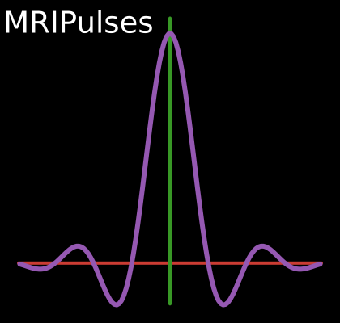

# MRIPulses.jl
A Julia package for designing RF pulses for MRI.

https://github.com/MagneticResonanceImaging/MRIPulses.jl

[![docs-stable][docs-stable-img]][docs-stable-url]
[![docs-dev][docs-dev-img]][docs-dev-url]
[![action status][action-img]][action-url]
[![pkgeval status][pkgeval-img]][pkgeval-url]
[![codecov][codecov-img]][codecov-url]
[![license][license-img]][license-url]
[![Aqua QA][aqua-img]][aqua-url]
[![code-style][code-blue-img]][code-blue-url]

Currently supports the following RF pulse design methods
- Shinnar-Le Roux (SLR)

See the documentation for example demos.

## Related packages

- https://github.com/felixhorger/MRIPulse.jl
- https://github.com/KookiesNKareem/KomaOpt
- https://github.com/control-toolbox/MagneticResonanceImaging.jl
- https://github.com/JuliaHealth/KomaMRI.jl
- https://github.com/MagneticResonanceImaging/BlochSimulators.jl
- https://github.com/MagneticResonanceImaging/BlochSim.jl
- https://github.com/mikgroup/sigpy/blob/main/sigpy/mri/rf/slr.py
- https://mrilab.sourceforge.net
- https://github.com/ismrm/mrhub

## Compatibility

Tested with Julia ≥ 1.12.

<!-- URLs -->
[action-img]: https://github.com/MagneticResonanceImaging/MRIPulses.jl/workflows/CI/badge.svg
[action-url]: https://github.com/MagneticResonanceImaging/MRIPulses.jl/actions
[pkgeval-img]: https://juliaci.github.io/NanosoldierReports/pkgeval_badges/M/MRIPulses.svg
[pkgeval-url]: https://juliaci.github.io/NanosoldierReports/pkgeval_badges/M/MRIPulses.html
[code-blue-img]: https://img.shields.io/badge/code%20style-blue-4495d1.svg
[code-blue-url]: https://github.com/invenia/BlueStyle
[codecov-img]: https://codecov.io/github/MagneticResonanceImaging/MRIPulses.jl/coverage.svg?branch=main
[codecov-url]: https://codecov.io/github/MagneticResonanceImaging/MRIPulses.jl?branch=main
[docs-stable-img]: https://img.shields.io/badge/docs-stable-blue.svg
[docs-stable-url]: https://MagneticResonanceImaging.github.io/MRIPulses.jl/stable
[docs-dev-img]: https://img.shields.io/badge/docs-dev-blue.svg
[docs-dev-url]: https://MagneticResonanceImaging.github.io/MRIPulses.jl/dev
[license-img]: https://img.shields.io/badge/license-MIT-brightgreen.svg
[license-url]: LICENSE
[aqua-img]: https://img.shields.io/badge/Aqua.jl-%F0%9F%8C%A2-aqua.svg
[aqua-url]: https://github.com/JuliaTesting/Aqua.jl
