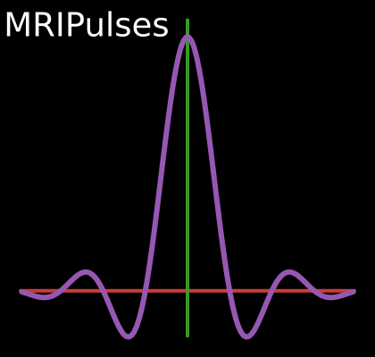

# MRIPulses.jl
A Julia package for designing RF pulses for MRI.

https://github.com/MagneticResonanceImaging/MRIPulses.jl

[![docs-stable][docs-stable-img]][docs-stable-url]
[![docs-dev][docs-dev-img]][docs-dev-url]
[![action][action-img]][action-url]
[![Aqua QA][aqua-img]][aqua-url]
[![codecov][codecov-img]][codecov-url]
[![deps][deps-img]][deps-url]
[![license][license-img]][license-url]
[![pkgeval][pkgeval-img]][pkgeval-url]
[![version][ver-img]][ver-url]

Currently supports the following RF pulse design methods
- Shinnar-Le Roux (SLR)

See the documentation for example demos.

The primary starting point is the function
`dzrf`
for designing RF pulses.
See the
[methods list](https://magneticresonanceimaging.github.io/MRIPulses.jl/stable/methods)
for documentation.

## License notes

The SLR design code was translated to Julia
from
[SigPy](https://github.com/mikgroup/sigpy/blob/main/sigpy/mri/rf/slr.py)
which has a
[BSD 3-Clause](https://github.com/mikgroup/sigpy/blob/main/LICENSE)
license.

That SigPy code itself
looks to have been translated
from
[John Pauly's circa 1992 Matlab code](https://github.com/toppeMRI/toppe/tree/main/%2Btoppe/%2Butils/%2Brf/%2Bjpauly)
that does not seem to include a license file
but includes the line
"(c) Board of Trustees, Leland Stanford Junior University."

## Related packages

- https://github.com/felixhorger/MRIPulse.jl
- https://github.com/KookiesNKareem/KomaOpt
- https://github.com/control-toolbox/MagneticResonanceImaging.jl
- https://github.com/JuliaHealth/KomaMRI.jl
- https://github.com/MagneticResonanceImaging/BlochSimulators.jl
- https://github.com/MagneticResonanceImaging/BlochSim.jl
- https://github.com/mikgroup/sigpy/blob/main/sigpy/mri/rf/slr.py
- https://mrilab.sourceforge.net
- https://github.com/ismrm/mrhub

## Compatibility

Tested with Julia ≥ 1.12.

<!-- URLs -->
[action-img]: https://github.com/MagneticResonanceImaging/MRIPulses.jl/workflows/CI/badge.svg
[action-url]: https://github.com/MagneticResonanceImaging/MRIPulses.jl/actions

[aqua-img]: https://juliatesting.github.io/Aqua.jl/dev/assets/badge.svg
[aqua-url]: https://github.com/JuliaTesting/Aqua.jl

[codecov-img]: https://codecov.io/github/MagneticResonanceImaging/MRIPulses.jl/coverage.svg?branch=main
[codecov-url]: https://codecov.io/github/MagneticResonanceImaging/MRIPulses.jl?branch=main

[deps-img]: https://juliahub.com/docs/MRIPulses/deps.svg
[deps-url]: https://juliahub.com/ui/Packages/MRIPulses

[docs-dev-img]: https://img.shields.io/badge/docs-dev-blue.svg
[docs-dev-url]: https://MagneticResonanceImaging.github.io/MRIPulses.jl/dev
[docs-stable-img]: https://img.shields.io/badge/docs-stable-blue.svg
[docs-stable-url]: https://MagneticResonanceImaging.github.io/MRIPulses.jl/stable

[license-img]: https://img.shields.io/badge/license-MIT-brightgreen.svg
[license-url]: LICENSE

[pkgeval-img]: https://juliaci.github.io/NanosoldierReports/pkgeval_badges/M/MRIPulses.svg
[pkgeval-url]: https://juliaci.github.io/NanosoldierReports/pkgeval_badges/M/MRIPulses.html

[ver-img]: https://juliahub.com/docs/MRIPulses/version.svg
[ver-url]: https://juliahub.com/ui/Packages/MRIPulses
